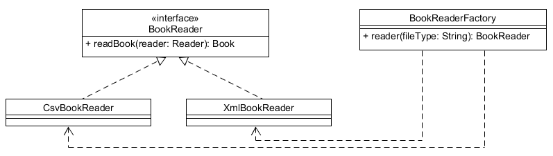
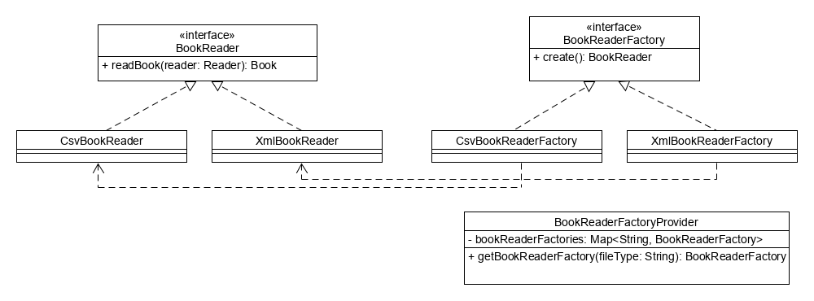
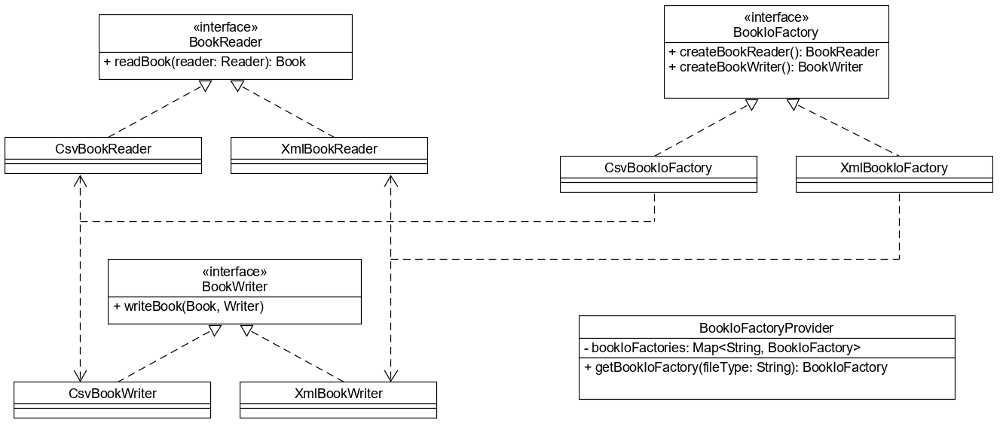
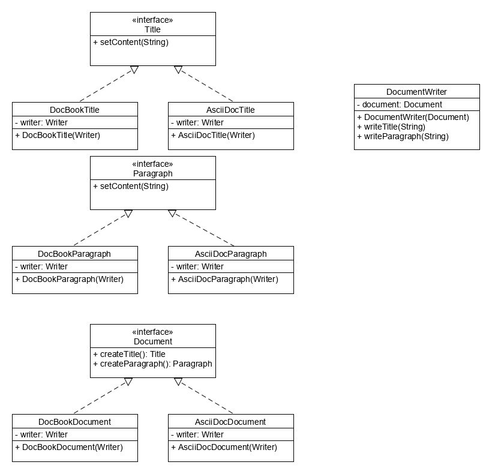
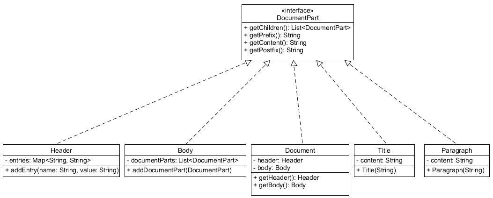

# Gyakorlati feladatok

## Bevezetés

A gyakorlati feladatok esetén előre megadott tesztesetek vannak. Ezek, és a szöveges feladatleírás
együtt definiálja a megoldandó feladatot. Vannak olyan részek, melyek a szövegben nincsenek definiálva,
csak a tesztesetekből lehet kitalálni.

A projektet megnyitva, mivel csak tesztesetek vannak, az nem fordul le. Ezért érdemes egy új projektet
létrehozni, és feladatonként átmásolni a teszteseteket.

## Simple Factory

A feladat, hogy könyvek adatait többféle fájlból is be lehessen olvasni.
Ehhez hozd létre a `Book` osztályt!
Minden beolvasó osztály ugyanazt a `readBook(Reader reader)` metódust kell implementálja (`BookReader` interfész). Készíts egy `BookReaderFactory` osztályt, amely a fájl kiterjesztése alapján a megfelelő `BookReader ` interfészt implementáló osztály egy példányát gyártja le! Ha nem ismert kiterjesztést talál, akkor dobjon kivételt!

A `CsvBookReader` implementációjához használd a `Scanner` osztályt! Ez képes elválasztó karakterek alapján `String`-eket beolvasni, akár egy `BufferedReader`-ből.

Az `XmlBookReader` implementációjához használd a JAXB-t! Ehhez a `Book` osztályon helyezd el a `@XmlRootElement` annotációt, és az XML állomány
beolvasása a következőképp történhet:

```java
try {
    JAXBContext ctx = JAXBContext.newInstance(Book.class);
    Unmarshaller unmarshaller = ctx.createUnmarshaller();
    return (Book) unmarshaller.unmarshal(reader);
}
catch (Exception e) {
    throw new IllegalStateException("Error parsing xml", e);
}
```



## Factory Method

A feladat, hogy könyvek adatait többféle fájlból is be lehessen olvasni.
Ehhez hozd létre a `Book` osztályt!
Minden beolvasó
osztály implementálja a `BookReader` interfészt. Minden konkrét `BookReader` implementációhoz saját factory osztály
tartozik, melyek egy-egy példányát a `BookReaderFactoryProvider` osztály tartalmazza egy `Map<String, BookReaderFactory>`
típusú attribútumban, mely tartalmazza a formátumot, pl. `csv`, és a hozzá tartozó
osztály egy példányát, pl. `CsvBookReaderFactory`. Már a deklarációs utasításban fel lehet tölteni a `Map.of` metódussal.

A megfelelő `BookReader`-t előállító osztályt tőle kérhetjük le.



## Abstract Factory

A feladat, hogy könyvek adatait többféle fájlból is be lehessen olvasni, és ki lehessen írni.
Ehhez hozd létre a `Book` osztályt!
Minden fájltípushoz készítsd el a megfelelő `BookReader` és `BookWriter` interfészt implementáló
konkrét osztályt! A `BookIoFactory` implementációk nem csak a `BookReader`-t  képesek legyártani, hanem az
ugyanolyan fájltípushoz tartozó `BookWriter`-t is. A `BookIoFactoryProvider` az összes factory példányt
`Map<String, BookIoFactory> ` típusú attribútumban tárolja,
ahol a kulcs a formátum (pl. `xml`), és az érték pedig egy `BookIoFactory` példány.

A `CsvBookWriter` implementációjához csomagold a paraméterként kapott `Writer` objektumot egy
`BufferedWriter`-ba, majd hívd meg a `write()` metódusát.

A `XmlBookWriter` implementációjához használd a következő kódrészletet:

```java
try {
    JAXBContext ctx = JAXBContext.newInstance(Book.class);
    Marshaller marshaller = ctx.createMarshaller();
    marshaller.marshal(book, writer);
}
catch (Exception e) {
    throw new IllegalStateException("Error parsing xml", e);
}
```



## Builder

Hozz létre egy `TrackBuilder` osztályt a `Track` példányok legyártásához. A `name` attribútum nem lehet üres. A `List<Point> points` listát a deklarációnál hozd létre, a pontokat egyenként a `withPoint` metódussal lehessen hozzáadni. A metódus paraméterként kapja meg a `Point` attribútumait egyenként (`lat`, `lon`, `elevation`, `time` sorrendben). Ellenőrizze, hogy a `lat` -90 és 90 közötti, a `lon` pedig -180 és 180 közötti-e, rossz érték esetén dobjon kivételt.

## Prototype

A feladat egy e-mailküldő szolgáltatás elkészítése, ahol van egy e-mail sablon,
kitöltve alapadatokkal, amit ki lehet küldeni egy megadott e-mail címre, de
meg lehet változtatni a tartalmát is, és úgy lehet kitölteni. Ekkor a sablon ne
változzon!

Készíts egy immutable `Address` osztályt, `name` és `email` attribútumokkal,
melyek típusa `String`! Készíts egy mutable `MailContent` osztályt,
`mimeType` és `text` attribútumokkal, melyek típusa `String`! Hozz létre egy
mutable `Mail` osztályt is, `List<Address> to`, `Address from`,
`String subject` és `MailContent mailContent` attribútumokkal!

Hozzd létre a megfelelő konstruktorokat is! A `MailContent`
osztálynak készíts egy un. copy-konstruktort, ami lemásolja a
paraméterként átadott `MailContent` példány attribútumainak értékeit.
Ugyanezt tedd meg a `Mail` osztályban is.

Majd hozz létre egy `MailSender` interfészt, melynek van egy `void send(Mail mail)`
metódusa. Nem kell implementációt írni, a teszteset mockolni fogja.

Majd hozz létre egy `MailService` osztályt! Ennek legyen egy `Mail` típusú
attribútuma, aminek egyből értéket is kell adni a deklarációs utasításban,
amiről majd a másolatok fognak elkészülni. Ez a sablon.

A sablon a következő értékeket tartalmazza:

* Feladó: `new Address("Training360", "info@training360.com")`
* Címzett: egy elemű lista `new Address("Mindenki", "all@training360.com")` értékkel
* Tárgy: `Körlevél`
* Törzs: `new MailContent("text/plain", "Kedves Mindenki!\nVárunk mindenkit a havi megbeszélésre! Training360")`

A `MailService` osztályban implementáld a következő metódusokat:

* `public void send(Address to)`
* `public void send(Address to, String mimeType, String content)`

Ezek a
`Mail` attribútum alapján készítenek egy másolatot, majd felülírják a metódusok
paramétereiben átadott értékeket. A `MailService`-nek
 van egy `MailSender` típusú attribútuma, amit konstruktorban kap meg (konstruktor
 injection). Amikor előállt a `Mail` példány, a `MailService` meghívja
  a `MailSender.send(Mail)` metódusát.
`send()` metódusát meghívva.

## Singleton

Készíts egy `EmployeeService` osztályt, amely `employees` attribútumában tárolja az alkalmazottak nevét. A listához lehet új alkalmazottat hozzáadni, illetve a lista nem módostható nézetét lekérdezni. Az osztályt lásd el `@Service` annotációval. Készíts két kontroller osztályt, amelyek ugyanarra az `EmployeeService` példányra tartalmaznak referenciát! A példányt konstruktorban kapják meg. Az `AddEmployeeController` új alkalmazott felvételéért a listába, míg a `ListEmployeesController` az alkalmazottak listázásáért felelős. Mindkét osztályt lásd el `@Controller` annotációkkal.

A Spring keretrendszer a felannotált osztályokból beaneket készít, amelyeket a Spring Containerbe helyez el. Az ezek közötti kapcsolatokat dependency injectionnel hozza létre. Az összekapcsolásokat vagy az osztályba tett `@Autowired` annotációval, vagy a konfigurációs osztályra tett `@ComponentScan` annotációval érhetjük el. Ha az egyik bean konstruktorában olyan paramétert talál, amilyen bean már létezik, akkor abból nem készít új példányt, hanem a létezőt adja át, így az `EmployeeService` osztályból csak egy példány készül.

## Adapter

Tegyük fel, hogy implementálni kell egy webshop alkalmazást, melynek van egy menüje, melyben menüpontok találhatóak.
Minden menüpontnak
van neve, valamint tartalmaz hivatkozásokat az almenüpontjaira. Ezen kívül a menüben kiírásra kerül, hogy
a menüpont alatt összesen hány almenüpont található (nem csak közvetlenül).

Az alkalmazás ezen kívül tartalmaz egy kategóriafát is, melyekbe az árult termékeket csoportosítják.
Ezen kategóriákat a menüben meg kell tudni jeleníteni.

A menüpontokat a `MenuItem` interfész tartalmazza.

```java
public interface MenuItem {

    List<MenuItem> getChildren();

    String getName();

    int numberOfAllChildren();
}
```

A kategóriákat a `Category` osztály.

```java
public class Category {

    private String name;

    private List<Category> subcategories;

    // Konstruktorok és getter metódusok

}
```

Hozz létre egy `CategoryMenuItemAdapter` osztályt, mely lehetővé teszi, hogy a kategóriákat
meg lehessen jeleníteni a menüben.

Figyelj a következőkre:

* A kategóriafát csak egyszer járja be, azaz amennyiben egyszer előállításra kerül a menü, többet
már ne kelljen előállítani. (Tipp: tárold el attribútumban a már kiszámolt értékeket!)
* Ne használj ciklust, csak Java 8 streameket!

## Bridge

A bridge tervezési mintát használva készíts egy olyan dokumentumíró rendszert, amely bármilyen dokumentumot tud kezelni.
Ehhez először készítsd el az egységes kezelést lehetővé tevő `Document`, `Paragraph` és `Title` interfészeket,
majd azok két implementációját: az AsciiDoc dokumentumokhoz az `asciidoc` csomagba az `AsciiDocDocument`, `AsciiDocParagraph`
és `AsciiDocTitle` osztályt, és ebookokhoz a `docbook` csomagba a `DocBookDocument`, `DocBookParagraph` és `DocBookTitle`
osztályt. A `Document` interfész terjessze ki a `Closable` interfészt.

Minden osztálynak van egy `Writer` típusú attribútuma, melyet konstruktorban kap meg.



### Osztályok megvalósítása

`AsciiDocTitle`

`setContent(String)`: a paraméterként kapott szöveg a `Writer` segítségével írja ki `= szöveg\n\n` formában (egyenlőségjel, szóköz, a szöveg majd két sortörés).

`AsciiDocParagraph`

`setContent(String)`: a paraméterként kapott szöveger a `Writer` segítségével írja ki `szöveg\n\n` formában (szóköz, a szöveg majd két sortörés)

`AsciiDocDocument`

`createTitle()`, `createParagraph()`: új `AsciiDocTitle`, illetve `AsciiParagraph` objektumot hoz létre a saját `Writer` attribútumát átadva

`close()`: tovább delegálja a feladatot a  `Writer` objektumnak

`DocBookTitle`

`setContent(String)`: a kapott szöveget `<title>szöveg</title>` formátumban írja ki

`DocBookParagraph`

`setcontent(String)`: a kapott szöveget `<para>szöveg</para>` formátumban írja ki

`DocBookDocument`

Minden dokumentum xml formátumú, amely gyökéreleme az `article`. Az xml definíciót és a nyitó `article` tag-et a konstruktor írja a kapott `Writer` objektumba:

```xml
<?xml version="1.0" encoding="utf-8"?>
<article xmlns="http://docbook.org/ns/docbook" version="5.0" xml:lang="en">
```

A záró tag-et a `close()` metódus rakja ki, majd lezárja a `Writer`-t.

`createTitle()`, `createParagraph()`: új `DocBookTitle`, illetve `DocBookParagraph` objektumot hoz létre a saját `Writer` objektumát átadva.

Sikertelen írás esetén a metódusok `IllegalStateException` kivételt dobnak.

Készítsd el a `DocumentWriter` osztályt, amely bármilyen `Document` interfészt implementáló osztályba tud címet és bekezdést írni, valamint le tudja azt zárni, függetlenül attól, hogy melyik implementációt használja. Az osztály implementálja a `Closable` interfészt.

A dokumentumot konstruktorban kapja meg. A `writeTitle(String)`, `writeParagraph(String)` és `close()` metódusai csak tovább delegálják a feladatot a dokumentumnak.

## Composite

A composite tervezési mintát használva hozz létre egy dokumentumot részekből összerakva. Készíts egy `DocumentPart` interfészt, mely az elemek egységes kezeléséhez szükséges metódusokat tartalmazza.

A `Document` két részből áll: `Header` és `Body`.

A `Header` a dokumentum tulajdonságait tartalmazza egy `Map`-ben, melyhez újat az `addEntry()` metódussal adhatunk. Előtagja `---\n`, utótagja `---\n\n`, a tartalma pedig a `Map` elemeit adja vissza szövegként `kulcs: érték` formátumban, minden elemet külön sorban. Gyermek elemeket nem tartalmaz.

A `Body`-nak nincs sem előtagja, sem utótagja, sem tartalma, viszont a gyermek elemeit listában tartalmazza. Lehet új elemet hozzáadni az `addDocumentPart` metódussal.

A `Title` objektumnak nincsenek gyermekei, sem elő- vagy utótagja. A tartalma mindig `# ` -tel és egy szóközzel kezdődik és sorvége jellel végződik.

A `Paragraph` objektumnak nincsenek sem gyermekei, sem elő- vagy utótagja. A tartalma mindig új sor (`\n`) karakterrel végződik.



Készíts egy `DocumentWriter` osztályt, mely egyetlen metódust tartalmaz. A `write()` metódus megkapja a dokumentum egy elemét, és a második paraméterként átadott `Writer` objektumba írja az alábbi sorrendben: prefix, tartalom, gyermekek adatai, postfix.

## Decorator

Készíts `ByteFilterInputStream` dekorátor osztályt az `InputStream`-hez, mely konstruktorában a becsomagolt `Inputstream`-en kívül egy `IntPredicate`
típusú szűrőfeltételt is kap. Csak az `InputStream` `read()` metódusát úgy írd felül (ugyanis a többi metódus
ezt a metódust hívja), hogy csak a feltételnek megfelelő bájtokat olvassa fel egyenként.

Úgy implementáld, hogy olvassa be a karaktereket, amíg az vagy megengedett karakter, vagy a végére nem ér. Azaz egy ciklusban kell olvasni be
a bájtokat. Amennyiben nem felel meg a bájt a feltételnek, lépjen tovább.

## Facade

Készíts egy `JdbcFacade` osztályt, mely elrejti a jdbc API bonyolultságát. Egyetlen attribútuma egy `DataSource`, melyet a
konstruktorában kap meg. A `queryForObject()` generikus metódus első paramétere az végrehajtandó SQL lekérdezést tartalmazza,
második `Function` paramétere képes kinyerni az eredményből (`ResultSet`) a keresett objektumot.
Visszatérési értéke `Optional<T>`, mely üres eredményhalmazra üres, egyetlen sort tartalmazó eredményhalmazra az abból kinyert
objektumot tartalmazza, több soros eredmény esetén `IllegalStateException` kivételt dob.

## Flyweight

Készíts egy `Rectangle` osztályt, mely egész oldalhosszúságú téglalapot modellez. Az osztály gondoskodjon arról, hogy ne legyen a program futása alatt
ugyanolyan méretű téglalapból két példány, illetve legyen szálbiztos.

Készíts egy `Calculator` osztályt, melynek `calculateDistances()` metódusa kiszámítja, hogy a paraméterként kapott téglalapokat
az adott szélességű területre milyen vízszintes távolságra kell letenni, ha egyenletesen szeretnénk elosztani őket. Ez azt jelenti,
hogy a téglalapok között egyenlő távolság legyen. Azaz a hosszból ki kell vonni a téglalapok szélességének összegét, és elosztani a téglalapok
száma mínusz egyel (hiszen ennyi darabszámú hely van a téglalapok között).
Ha nem férnek el a megadott szélességen, a metódus dobjon `IllegalArgumentException` kivételt.

## Proxy

Az `ArticleService` interfész `DefaultArticleService` implementációjában a `saveArticle()` metódus csak azok számára legyen elérhető, akik megfelelő jogosultsággal rendelkeznek. Hogy milyen jogosultság szükséges hozzá, azt a metódusra tett `@Secured` annotációban lehet megadni. A felhasználót és a szerepkörét a `SecurityContext` osztály tartalmazza.

Készíts egy `ArticleServiceFactory` osztályt, amelynek a `getArticleServiceProxy()` statikus metódusa a paraméterként kapott `ArticleService` és `SecurityContext` objektumok használatával elkészíti az `ArticleService` proxy változatát. Használd a Java `Proxy` osztályát, amihez szükséged lesz egy `InvocationHandler` implementációra is. A `SecurityInvocationHandler` osztály példányosításkor kapjon meg egy `ArticleService` és egy `SecurityContext` objektumot, és az `invoke()` metódusa ellenőrizze le, hogy a meghívott `ArticleService` metódushoz kaphat-e hozzáférést a `SecurityContext` objektumban definiált hívó. Ha igen, akkor  továbbítsa a kérést a `ArticleService` objektumhoz, amennyiben nem, a metódus dobjon `SecurityException` kivételt.

## Chain of Responsibility

Egy fa csúcspontjait úgy ábrázoljuk, hogy referenciát tartson a szülőre és a gyermekeire is. Amikor egy esemény történik valamelyik csúcson, és az nem tudja kezelni, akkor az eseményt továbbítja a szülő felé. Ha tudja kezelni, akkor az eseményt regisztrálja.


A `SimpleNode` továbbpasszolja a szülő felé az eseményt, míg a `HandlerNode` eltárolja a kapott eseményt az `events` listában.

## Command

Tegyük fel, hogy implementálni kell egy alkalmazást, mely különböző érdekes pontokat tartalmaz. Mindegyik pontnak van egy szöveges
azonosítója, egy neve, és egy koordinátája.

Az alkalmazáson belül ilyen érdekes pontokat lehet létrehozni és módosítani. A módosítás parancsokkal
történik. Az alkalmazás nem az aktuális állapotot tárolja el, csak a parancsokat sorrendben,
és lekérdezéskor mindig a parancsok alapján újra kiszámítja az érdekes pontok állapotát.

Egy érdekes pontot a `Location` osztály reprezentál.

```java
public class Location {

    private String id;

    private String name;

    private int x;

    private int y;

    // Konstruktorok, getter és setter metódusok
}
```

A paranocsok a `Command` interfészt implementálják.

```java
public interface Command {

    boolean isCreate();

    String getLocationId();

    Location createLocation();

    void modifyLocation(Location location);
}
```

A kezdő parancs (létrehozáskor) a `CreateLocationCommand`, annak `isCreate()` metódusa
`true` értéket ad vissza, ekkor a `createLocation()` metódusának hívásakor hoz létre egy
új `Location` objektumot. A többi parancs módosító parancs, a `modifyLocation(Location)`
metódusát kell meghívni. Módosítja a paraméterként átadott `Location` állapotát setter
metódusokkal. Parancsok:

* `ChangeNameCommand` - nevet módosítja
* `MoveToCommand` - adott értékekre állítja a koordinátákat
* `MoveRelativeCommand` - a commandban megadott értékeket hozzáadja a `Location` `x` és `y`
    koordinátájához

A parancsokat a `LocationService` tárolja egy `Map<String, List<Command>>` adatszerkezetben.
A `Map` kulcsa az érdekes pont azonosítója.

A `LocationService` metódusai:

* `receiveCommand(Command)` - eltárolja a parancsot a `Map`-ben
* `Location findById(String)` - a `Map`-ből betölti a parancsokat az adott `id` alapján,
majd az elsőnek meghívja a `createLocation()` metódusát, a többinek a `modifyLocation`
metódusát. Az eredményt visszaadja.
* `undo(String)` - az adott `id`-re vonatkozóan az utolsó parancsot eltávolítja a listából

## Interpreter

A Spring Expression Language (SpEL) kifejezései támogatják az objektum gráf futási időben történő lekérdezését és módosítását. A kifejezések szövegként adhatóak meg, és különféle operátorokat tartalmazhatnak.

Használatához egy `SpelExpressionParser` példányra és az általa kiértékelt kifejezésre van szükségünk.

```java
String expression = "#{someBean.someProperty != null ? someBean.someProperty : 'default'}" ;
ExpressionParser parser = new SpelExpressionParser();
Expression exp = parser.parseExpression(expression);
```

Ha a kifejezést egy adott objektumra szeretnénk alkalmazni, akkor létre kell hoznunk vele egy kontextust is.

```java
EvaluationContext context = new StandardEvaluationContext(obj);
```

A kiértékelés eredményét az `Expression` példány `getValue()` metódusával érjük el, mely paraméterként a kontextust várja, ha van. Visszatérési típusa `Object`.

Készíts egy `CitySelector` osztályt, amely konstruktorában egy `City` listát kap, a `selectName(String)` metódusa pedig azon városok nevének listájával tér vissza, amelyek a paraméterként átadott (SpEL) kifejezésnek megfelelnek.

## Iterator

Valósíts meg egy fa adatszerkezetet. Ehhez hozz létre egy `Tree` generikus osztályt, mely `root` attribútumában a gyökérelemet tárolja.
Minden elem, így a gyökér is `Node` típusú. Ezt statikus belső osztályként valósítsd meg. Az adott csúcson tárolt értéket a `value` attribútum
tárolja, `parent` attribútuma referenciát tart a szülő csúcsra, `children` attribútuma pedig a gyermek `Node` objektumok listáját tartalmazza.
`Node` objektumot lehessen létrehozni szülő nélkül is, csupán az érték megadásával.  Gyermekeket egyenként az `addChild()` metódussal lehet hozzáadni.

Készíts iterátort hozzá, mely bejárja a fát, és adja vissza az elemeket (először az elemet, majd annak gyermekeit sorban). Az `iterator()`
metódus egy belső osztály (pl. `TreeIterator`) egy
példányát adja vissza, mely implementálja az `Iterator` interfészt. Úgy implementáld, hogy a konstruktorban át lehessen adni neki a
gyökérelemet, és ekkor a fát bejárja, az elemeket elhelyezi egy listába. Az `Iterator` `hasNext()` és `next()`metódusa ezen a listán dolgozzon, és
egy `int` típusú attribútumban tárolja el, hogy épp hol tart a feldolgozásban.

A `Tree` osztály metódusai:

`createRoot(T value)`: létrehozza a gyökér elemet

`addChild(T parent, T element)`: a megadott értékű szülő alá szúrja be az új elemet

`Iterator<T> iterator()`: a fát a gyökerétől bejáró iterátor egy példányát adja

## Mediator

Adott egy könyveket nyilvántartó alkalmazás. Ebben van egy űrlap, mely használatos
új könyv felvitelére, és létező könyv szerkesztésére is.

A könyvet a `Book` osztály reprezentálja.

```java
public class Book {

    private Long id;

    private String author;

    private String title;
}
```

Az űrlap négy komponensből épül fel, egy beviteli mező tartalmazza az
azonosítót, egy a szerzőt, egy a címet, és van egy gomb.

Egy komponens így épül fel:

```java
public class Component {

    private ComponentType componentType;

    private boolean visible;

    private String value;
}
```

Ahol a `ComponentType`:

```java
public enum ComponentType {

    INPUT, READONLY, BUTTON
}
```

Írj egy `InsertUpdateForm` osztályt, mely attribútumként tartalmazza a négy komponenst (, ezekhez
getter metódusokkal hozzá lehet férni).
Ha meghívod a `toInsert()` metódusát, az űrlap felvitel módba vált, a komponensek értékei nullázódnak,
az azonosítót tartalmazó mező eltűnik, és a gomb szövege `Insert` szövegre változik.

Ha meghívod a `toUpdate(Book)` metódusát, az űrlap módosítás módba vált, a komponensek értékei feltöltődnek
a paraméterként átadott könyv állapotával (vigyázz, az azonosító egész szám, de a komponens csak szöveges
értéket tud tárolni).

Ha meghívod a `submit()` metódust, visszaad egy `Book` példányt, aminek az értékei ki vannak töltve a
komponensekben megadott értékekkel.

## Memento

Tegyük fel, hogy egy alkalmazást kell implementálni, mely dokumentumokat tárol. Minden dokumentum rendelkezik szerzőkkel,
címmel és bekezdésekkel. A bekezdésnek csak szövege van.

Amennyiben szerkesztés közben a felhasználó ment, az aktuális állapot elmentésre kerül.
A felhasználó mindig visszaállhat egy előző, mentett állapotra.

A dokumentum felépítése:

```java
public class Document {

    private List<String> authors = new ArrayList<>();

    private String title;

    private List<Paragraph> paragraphs = new ArrayList<>();
}
```

Egy bekezdés felépítése:

```java
public class Paragraph {

    private String text;
}
```

Az állapotok mentését a `DocumentHistory` osztály végzi. Tartalmazza a dokumentum aktuális
állapotát, valamint egy vermet a dokumentumok régebbi verziójának eltárolására. A verem
`DocumentMemento` immutable objektumokat tartalmaz. Vigyázzunk arra, hogy a dokumentum
módosításai ne hassanak vissza a memento objektumokra (deep clone), másrészt a memento
módosíthatatlan legyen (`Collections.unmodifiableList()`). A `Document` tartalmazzon
egy `DocumentMemento createMemento()` és egy `restoreFromMemento(DocumentMemento)`
metódust!

## Observer

Alkalmazáson belül léteznek számlák, és azon belül számla tételek. Minden számla tételhez
tartozik egy ár. Azért, hogy ne kelljen
mindig újra számolni végösszeget (számla tételek árainak összegét), a számla tartalmazza azt.
Azonban a számla tételek árai változhatnak. Ebben az esetben a számlában lévő végösszegnek is
változnia kell.

A számlában lévő kollekcióhoz nem lehet közvetlen hozzáférni, csupán a tételekhez.

A számla, azaz `Bill` osztály:

```java
public class Bill {

    public void addBillItem(BillItem billItem) {
        // ...
    }

    public int numberOfBillItems() {
        // ...
    }

    public BillItem getBillItemAt(int i) {
        // ...
    }

    public int getSum() {
        // ...
    }
}
```

A számla tétel, azaz `BillItem` osztály:

```java
public class BillItem {

    private int price;

    // Konstruktorok, getter és setter metódusok
}
```

A számla tételben bekövetkező változásokra a következőképp lehet feliratkozni:

```java
billItem.onChange(e -> diff = e.getDiff());
```

Ekkor vajon milyen paraméterrel kell definiálni az `onChange()` metódust?

A tesztesetek létrehoznak egy számlát, majd új tételt adnak hozzá, valamint a tétel árát változtatják.

## State

Egy gombbal lehet állítani az autóban az ülésfűtést. Alapállapotban ki van kapcsolva.
Ha ekkor megnyomjuk, akkor maximális (3-as) fokozatra kapcsol a fűtés, ha még egyszer megnyomjuk,
akkor 2-es fokozatra áll, ha még egyszer, akkor 1-esre áll, és ha még egyszer, akkor kikapcsol.
Szimuláljuk a gomb működését, hogyan vált a négy állapot között.

Az állapotot reprezentálja a `SeatHeaterState` enum. Az állapot még azt is vissza tudja adni
egész számmal, hogy milyen erősségű a fűtés (megegyezik a fokozat számával, `OFF` esetén nulla.


## Strategy

Egy közösségi hálózat tagjait a `Member` osztály modellezi. Készíts egy `SocialNetwork` osztályt, mely a tagok listáját tartalmazza, amit a konstruktorban kap meg.

Készíts két metódust:

A `findMembersBy()` metódus azon tagok listáját adja vissza, amelyek megfelelnek egy bizonyos feltételnek. Annak vizsgálata, hogy egy tag megfelel-e az adott feltételnek, legyen cserélhető.
Paraméterként használd a `Predicate` interfészt!

Az `applyToSelectedMembers()` metódus a feltételnek megfelelő tagokon végrehajt egy műveletet. Mind a feltétel vizsgálatát, mind a műveletet végző algoritmus legyen cserélhető.
Paraméterként használd a `Predicate` interfészt!

## Template Method

A `BillItem` osztály egy számlatétel nevét és nettó árát tartalmazza. Készíts egy `Bill` osztályt, mely a számlatételek listáját tartalmazza.
A `sum()` metódusa végzi el a számlatételek bruttósított összegzését. Ennek logikáját a paraméterül kapott `Summerize` példány tartalmazza.
Mivel az ÁFA és a kerekítési módszerek is különbözhetnek, ezért a template method tervezési minta használatával készítsd el a különböző megvalósításokat.
A `Summarize` absztakt osztály `sum()` metódusa a paraméterként kapott `Bill` objektum tételeit egyenként bruttósítja, majd a bruttó árakat kerekíti és összegzi.
A végösszegen még egy kerekítést végez, melynek módja különbözhet a tételenkénti kerekítés módjától. A `Summarize` osztálynak két konkrét megvalósítása
a `Vat10HalfEvenRoundSummarize` és a `Vat27MathRoundSummerize`.

A `Summarize` osztály `sum()` metódusa meghívja a másik két absztakt metódusát:

* `BigDecimal calculateVat(BigDecimal d)` - tételenkénti bruttósítást, azaz ÁFA-számítást végez
* `BigDecimal finalRound(BigDecimal d)` - végső kerekítést végzi

Az első esetben az ÁFA mértéke 10%. A tételek bruttó árát összegzés előtt egészre kerekíti úgy, hogy a pont két egész között félútra esőket a
legközelebbi páros szám felé kerekíti. Összegzés után a matematika szabályai szerint kerekít.

A második esetben az ÁFA mértéke 27%. A tételek bruttó árát összegzés előtt és után is a matematika szabályai szerint egészre kerekíti.

## Visitor

Egy dokumentum és részei mind implementálják az `Item` interfészt. A dokumentumot a `Document` osztály, a címet a `Title` osztály, egy bekezdést
pedig a `Paragraph` osztály reprezentál. Az `Item` definiál egy `List<Item> getChildren()` metódust. A `Title` és a `Paragraph` mindig egy
üres listát ad vissza. A dokumentum a részeit egy `List<Item>` attribútumban tárolja, mely üresen kerül létrehozása, és egy `addItem(Item item)`
metódussal lehet hozzá újabb részeket adni. A `getChildren()` metódus visszaadja ezeket a részeket. A `Title` és a `Paragraph` is tartalmaz
egy `String text` attribútumot, melyet konstruktorban megkap, valamint van rá getter és setter is.

A visitor tervezési minta használatával bővítsd ki mindhárom implementációt olyan funkcióval, mely az adott cím vagy bekezdés tartalmát,
dokumentum esetén pedig annak minden címét és bekezdését nagybetűsíti.

Tipp: az `Item` interfészbe hozz létre egy `void visit(ItemVisitor itemVisitor)` metódust. Az `ItemVisitor` interfészben pedig `visit(...)`
metódusokat, ahol a paraméterek sorban az `Item` implementációk.
