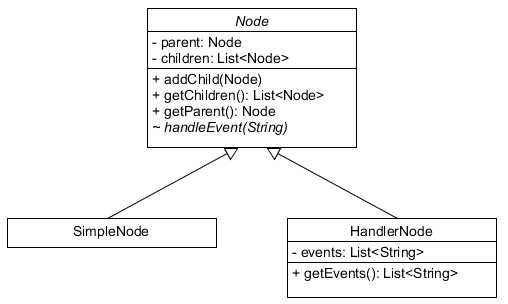

class: inverse, center, middle

.training360-logo[]
# Tervezési minták

---

## Tematika

* Tervezési minták háttere
* Tervezési minták jellemzői
* Létrehozási minták
* Viselkedési minták
* Szerkezeti minták

---

## Források

* Erich Gamma, Richard Helm, Ralph Johnson és John Vlissides: Design Patterns: Elements of Reusable Object-Oriented Software (Addison-Wesley Professional; 1 edition (November 10, 1994))
* Eric Freeman,‎ Bert Bates,‎ Kathy Sierra,‎ Elisabeth Robson:  Head First Design Patterns: A Brain-Friendly Guide O'Reilly Media; 1st edition (October 2004)
* https://stackoverflow.com/questions/1673841/examples-of-gof-design-patterns-in-javas-core-libraries

---

class: inverse, center, middle

.training360-logo[]
Lecke
## Tervezési minták háttere

---

## OO háttér

* Négy oo alapelv: *A-PIE* (Abstraction, Polymorphism, Inheritance, Encapsulation)
* Objektumorientált alapelvek, high cohesion, low coupling
* Single responsibility, legkisebb felelősségi kör
* Együtt változó részek egységbe zárása, külön változó részek elválasztása
* Programozzunk interfészekkel
* Delegálás

---

## Kompozíció használata az öröklődés helyett

* Plusz viselkedés bevezetésére
* Az öröklődés statikus, futás időben nem cserélhető
* Több programozási nyelven az öröklődés egyszeres
* Kompozíció, és főleg interfészek használatával cserélhető
* Kompozíció lazább kapcsolat, az ősosztály viszont látható a leszármazottnak
* is-a kapcsolat helyett has-a kapcsolat
* Tesztelhető, test double-ök alkalmazásával
* Könnyebb kód újrafelhasználás
* Delegáció plusz kóddal jár

---

## Kompozíció használata az öröklődés helyett - Döntés alapja

* is-a kapcsolat?
* Tényleg bővítésről van szó?
* Ha csak a polimorfizmus miatt kell, interfészeket kell használni

---

## Tervezési tanácsok

* Implementáció elrejtése
* Minimális interfész
* Interfész iteratív fejlesztése
* Design by Contract
* Újrafelhasználhatóság vs. YAGNI

---

## Tervezési tanácsok

* Kiterjeszthetőség
* KISS
* DRY
* Tesztelés az interfészen keresztül
* Demeter törvénye ("csak a közvetlen barátaiddal beszélgess")

---

## S.O.L.I.D. elvek

* Szülőatyja Robert C. Martin, aka. Uncle Bob
* Single Responsibility Principle (SRP): felelősségi kör
* Open/Closed Principle (OCP): nyílt a kiterjesztésre, de zárt a módosításra

---

## S.O.L.I.D. elvek

* Liskov substitution principle (LSP): leszármazott átveheti a szülő szerepét, anélkül, hogy a működés megváltozna
* Interface segregation principle (ISP): a hívó csak azon metódusokról tudjon, amit használ is. Megoldás az interfészt több kisebbre bontani.
* Dependency inversion principle (DIP): függőség <br /> interfészre, csak deklarálja a függőségeket

---

## Inversion of control, AOP

* Keretrendszer hívja a kódot (tipikusan konténer hívja a komponenseket)
* Hollywood Principle: "Ne hívj, majd mi hívunk."
* Gyakran összekapcsolódik a dependency injectionnel
* Aspect Oriented Programming (AOP)

---

class: inverse, center, middle

.training360-logo[]
Lecke
## Tervezési minták jellemzői

---

## Tervezési minták

* Jól átgondolt, kiforrott, újrafelhasználható megoldási minták gyakran felmerülő tervezési problémákra
* A megoldást az adott problémára kell szabni
* Eredet: városrendezés (Christopher Alexander et. al: A Pattern Language:
Towns, Buildings, Construction)
* Rengeteg helyen használják, oo, programozási nyelvek, modularizáció, párhuzamosság, keretrendszerek, <br /> architektúrák (integráció)

---

## GoF tervezési minták

* Gang Of Four (*GoF*): Design Patterns: Elements of Reusable Object-Oriented Software
  * Erich Gamma, Richard Helm, Ralph Johnson, John Vlissides
* Objektumorientált környezet, osztályok és objektumok, valamint az ezek közötti kapcsolatok hogyan oldanak meg egy tervezési problémát
* 23 tervezési minta
* Szerkezet és működés
* Közös nyelv
* Gyakori UI példa

---

## Jellemzőik

* Az OO elvek ismerete még kevés
* Jó OO terv: újrafelhasználható, kiterjeszthető, karbantartható
* Nem kód, nem kész megoldás
* Nem lettek feltalálva, csak felfedezve
* Kipróbált iránymutatások
* Változási igényre adott válasz

---

## Kapcsolataik


---

## Csoportosításuk

* Létrehozási minták
* Szerkezeti minták
* Viselkedési minták

---

## Felépítésük

* Cél
* Egyéb nevek
* Feladat: egy konkrét probléma, ahol a minta alkalmazható
* Alkalmazhatóság: mikor alkalmazható
* Szerkezet
  * UML osztály és interakció diagramm
  * Szóhasználat: kliens - tervezési minta használója
* Résztvevők
* Együttműködés

---

## Felépítésük

* Következmények (előnyök és hátrányok)
* Megvalósítás: megoldás leírása
* Példakód
* Ismert előfordulásuk
* Kapcsolódó tervezési minták

---

## Létrehozási minták

* Klasszikus konstruktor kiváltása speciális igények miatt
* Létrehozás különválasztása
* Létrehozás felügyelt módon
* Hozzáférés a létrehozott példányokhoz
* Döntés
  * Mely osztály példányát kell létrehozni
* Elrejtés
  * Létrehozás vagy objektumstruktúra <br /> bonyolultságának elrejtése

---

## Létrehozási minták

* Abstract factory (Elvont gyár)
* Builder (Építő)
* Factory method (Gyártófüggvény)
* Prototype (Prototípus)
* Singleton (Egyke)

---

## Szerkezeti minták

* Bonyolultabb objektum szerkezetek speciális igények miatt
* Gyakori objektum kapcsolatok
* Csoportosításuk:
  * Osztályokra vonatkozó tervezési minták
  * Példányokra vonatkozó tervezési minták

---

## Szerkezeti minták

* Adapter (Illesztő)
* Bridge (Híd)
* Composite (Összetétel)
* Decorator (Díszítő)
* Facade (Homlokzat)
* Flyweight (Pehelysúlyú)
* Proxy (Helyettes)

---

## Viselkedési minták

* Egy algoritmus, felelősség, működés szétosztása több objektumra
* Objektumok közötti kommunikáció

---

## Viselkedési minták 1.

* Chain of responsibility (Felelősséglánc)
* Command (Parancs)
* Interpreter (Értelmező)
* Iterator (Bejáró)
* Mediator (Közvetítő)
* Memento (Emlékeztető)

---

## Viselkedési minták 2.

* Observer (Megfigyelő)
* State (Állapot)
* Strategy (Stratégia)
* Template method (Sablonfüggvény)
* Visitor (Látogató)

---

## Minták és az oo kapcsolata

* Bizonyos minták erősebben támaszkodnak bizonyos oo alapelvekre
  * Strategy: Kompozíció használata az öröklődés helyett
  * Observer: Inversion of control

---

class: inverse, center, middle

.training360-logo[]
Lecke
## Létrehozási minták

---

## Simple Factory

* Nem GoF tervezési minta
* Azonos típusú, de eltérő osztályú objektumok (*termék*) példányosítása valamely feltétel alapján
* Példányosítás a simple factory felelőssége, független a használótól
* A használó nem tudja, hogyan kell a példányosítást elvégezni, és mely dinamikus
típusú példányt kap vissza
* Tévhittel ellentétben nincs Factory tervezési minta

---

## Simple Factory példák

* `ResourceBundle#getBundle()` a `ResourceBundle.Control` alapján
* `NumberFormat#getInstance()`, `NumberFormat#getIntegerInstance()`, `NumberFormat#getCurrencyInstance()` metódusai különböző `NumberFormat` leszármazottakat ad  vissza
* `Charset#forName(String charsetName)`
* `JAXBContext#createMarshaller()`, `DocumentBuilderFactory#newInstance()`, `TransformerFactory#newInstance()`, `XPathFactory#newInstance()`    

---

## `JAXBContext` felderítés

* `jaxb.properties` fájlban definiáltak alapján
* `JAXB_CONTEXT_FACTORY` system property alapján
* `/META-INF/services/javax.xml.bind.JAXBContext` alapján
* Java SE implementáció dönt, tipikusan beépített

---

## Java service provider

* Java 9 Java Platform Module System
* Interfész, implementáció
* `module-info.java` állományban

---

## Java service provider kód

```java
provides BookmarkService with BookmarkServiceImpl;
```

```java
uses BookmarkService;
```

```java
ServiceLoader<BookmarkService> bookmarkServices = ServiceLoader.load(BookmarkService.class);
Iterator<BookmarkService> i = bookmarkServices.iterator();
while (i.hasNext()) {
    BookmarkService bookmarkService service = i.next();
}
```
---

## Simple Factory következmények

* Metódus törzsében elágazás
* Új osztály bevezetésekor bővíteni kell, használót nem érinti
* Tipikusan valami keresési sorrend

---

## Factory Method

* "Define an interface for creating an object, but let subclasses decide which class to instantiate."
* Interfész különböző implementációjának példányosítására
* Létrehozandó objektum interfésze ismert
* Factory Method esetén a létrehozónak is az interfésze definiált
* Különböző implementációi különböző implementációt <br /> példányosítanak

---

## Factory Method példák

* JDK példák
  * `iterator()` (interfész)
  * `DataSource#getConnection()` (interfész)
  * `DocumentBuilder.newDocument()` (absztrakt osztály)

---

## Factory Method (UML)


---

## Factory Method tulajdonságok

* Kliens nem tudja, milyen osztályt kell példányosítani
* Új implementáció könnyen bevezethető, eddigiek módosítása nélkül
* Ki hozza létre a creator példányt?

---

## Abstract Factory

* "Provide an interface for creating families of related or
dependent objects without specifying their concrete
classes."
* Interfész család különböző implementációjának példányosítására
* Mint a Factory Method, csak (tematikus) objektum családot hoz létre
* Factory Methodból nőhet ki

---

## Abstract Factory példák

* GoF példa: GUI toolkit
* Java példák
  * `Connection#createStatement()`, `Connection#prepareStatement()`, `Connection#prepareCall()` (interfész)
  * `Document#createElement()`, `Document#createTextNode()`, `Document#createComment()` <br /> (absztrakt osztály)

---

## Abstract Factory (UML)


---

## Abstract Factory tulajdonságok

* Új implementáció család könnyen bevezethető, eddigiek módosítása nélkül
* Családok általában diszjunkt halmazok
* Gyakran együtt a Bridge tervezési mintával

---

## Builder

* "Separate the construction of a complex object from its representation so that the same construction process can create different representations."
* A létrehozási logika külön az objektumtól
  * Létrehozás lépésenként, nem áll rendelkezésre egyben a szükséges információ
  * Különböző objektum állapot csoportok
  * Többféleképpen is felépíthető
* Method chaining, fluent interface (olvashatóság)

---

## Builder példák

* JDK példa
  * `java.lang.StringBuilder#append()`
  * `java.lang.ProcessBuilder`: parancsok, valamint be- és kimenettel kapcsolatos beállítások
* Java példa: `entityManager.createQuery()`
  * Query
  * Paraméterek
  * Lapozás
  * Hintek
  * Zárolás

---

## Builder (UML)


---

## Builder tulajdonságok

* Definiálhatunk egy alapértelmezett állapotot
* Ha nincs meg minden információ, kivételt dobhatunk
* Teleszkóp konstruktorok helyett
* Nem lehet "félkész" objektum

---

## Prototype

* "Specify the kinds of objects to create using a
prototypical instance, and create new objects by
copying this prototype"
* Az objektum létrehozás prototípus példány alapján
* Példány másolat, klón
* Clone: deep, shallow
* Copy konstruktor

---

## Prototype példák

* JDK példa: `java.lang.Object#clone()` (lsd. `java.lang.Cloneable` interfész)
* Java példa: Spring Framework prototype scope
* Java eszközök: Apache Commons `SerializationUtils`, `BeanUtils`

---

## Prototype (UML)


---

## Singleton

* "Ensure a class only has one instance, and provide a
global point of access to it."
* Leginkább megosztó tervezési minta
* Egy példány, és ahhoz közös hozzáférés
* Klasszikus: privát konstruktor, statikus attribútum
* Lazy initialization
* Párhuzamosság
* Cluster

---

## Singleton példák

* GoF példa: egy nyomtatóhoz csak egy nyomtatási sor
* JDK példa: `java.lang.Runtime#getRuntime()`

---

## Singleton (UML)


---

## Singleton tulajdonságok

* Effective Java szerint: enum
  * Nincs probléma a párhuzamossággal
  * Nem lehet reflectionnel megkerülni
* Globális állapot
* Nehezen tesztelhető
* Single Responsibility Principle megtörése, ugyanis <br /> felelős azért is, hogy belőle egy példány lehessen
  * Lásd Spring singleton scope, <br /> EJB (Singleton Session Bean)

---

class: inverse, center, middle

.training360-logo[]
Lecke
## Szerkezeti minták

---

## Adapter

* "Convert the interface of a class into another interface
clients expect. The Adapter pattern lets classes work
together that couldn't otherwise because of
incompatible interfaces."
* Meglévő objektum nem implementálja az elvárt interfészt, de használni akarjuk
* Inkompatibilitás feloldása
* Esetleg nem tudjuk módosítani (eltörünk valamit, külső könyvtár)
* Gyakori félreértés: interfészt implementáló osztály, <br /> üres metódus implementációkkal, Java 8 óta <br /> default metódusok

---

## Adapter példák

* JDK példa: `InputStreamReader(InputStream)`, `OutputStreamWriter(OutputStream)`

---

## Adapter (UML)


---

## Bridge

* "Decouple an abstraction from its implementation so
that the two can vary independently."
* Különböző osztály családok, de hasonló elven működnek
* Kliensnek nem kell róla tudnia, mely családot használja
* Absztrakt osztály család, diszjunkt implementáció családok
* Abstract Factory tervezési mintával együtt

---

## Bridge példák

* GoF példa: ablakozó keretrendszerek használata
* Java példa: API, különböző implementációkkal (JCP, JSR), XML kezelés, JDBC driver, Java EE API-k (JAXB, JPA, JMS, stb.)

---

## Bridge (UML)


---

## Composite

* "Compose objects into tree structures to represent part-whole hierarchies. Composite lets clients treat individual objects and compositions of objects uniformly."
* Bizonyos elemek más elemeket tartalmazhatnak, bizonyos elemek nem – kliensnek ezeket ne kelljen megkülönböztetnie
* Egész-rész hierarchia megvalósítása, azonos interfész használható a csomópontokon

---

## Composite példák

* JDK példa: Swing komponensek

---

## Composite (UML)


---

## Composite tulajdonságok

* Tipikusan fa hierarchia
* Bejárás
* Problémák: ciklikusság, végtelen ciklus, rekurzió
* Egyszerűbb kliens, nincs különbségtétel a közbülső csomópontok és levélelemek között
* Új komponens bevezetése egyszerűbb
* Néha túl általános lehet

---

## Decorator

* "Attach additional responsibilities to an object
dynamically. Decorators provide a flexible alternative
to subclassing for extending functionality."
* További felelősségek dinamikus (futásidejű) csatolása az objektumhoz
* Egymásba ágyazhatóság (láncolhatóság)
* Kliensek, ha tudják, hogy dekorátor van rajta, igénybe vehetik a szolgáltatásaikat
* Lásd még Wrapper, Function Wrapper

---

## Decorator példák

* JDK példa: `java.io.InputStream`, `OutputStream`, `Reader` és `Writer`, `java.utils.Collections` burkolók

---

## Decorator (UML)


---

## Facade

* "Provide a unified interface to a set of interfaces in a subsystem. Facade defines a higher-level interface that makes the subsystem easier to use."
* Könnyebb hozzáférés az alrendszerekhez, kliens dolgának megkönnyítése
  * Komplex rendszer megfelelő inicializálásokat, hívás sorrendet, paramétereket igényelhet - ezek elrejtése
* Egységesebb magasabb szintű interfész

---

## Facade példák

* JDK példa: `JOptionPane`
* Java példa: Java EE tervezési minta, Spring `JdbcTemplate`

---

## Facade (UML)


---

## Flyweight

* "Use sharing to support large numbers of fine-grained objects efficiently."
* Nagy mennyiségű objektum helyett néhány
* Több kliens ugyanazt oszthatja meg
* Tipikusan Factory Method vagy Abstract Factory használatával
* Immutable

---

## Flyweight példák

* GoF példa: betűk egy szövegszerkesztőben
* JDK: `String`; `Integer`, stb. `valueOf()` metódusok

---

## Flyweight (UML)


---

## Proxy

* "Provide a surrogate or placeholder for another object to control access to it."
* Egy objektumhoz hozzáférést szabályoz helyettesítéssel, cserével
* Remote, költséges objektumok (cache, lazy), védelmi (hozzáférés szabályozás), okos (naplózás, kölcsönös kizárás, referencia számlálás)

---

## Proxy példák

* JDK példa: RMI, Java Dynamic Proxies 

```java
public static Object newProxyInstance(ClassLoader loader, 
                                      Class<?>[] interfaces,
                                      InvocationHandler h)
                               throws IllegalArgumentException`)
```

* Java példa:
  * EJB, Spring managed bean, lazy, async, <br /> transaction, security, webszolgáltatások
    * Megvalósítása AOP-val

---

## Proxy (UML)


---

## Proxy tulajdonságok

* Gyakran dependency injectionnel, így a kliens nem tud a cseréről
* Egymásba ágyazhatóak
* Furcsa stacktrace
* Nem várt működés
* Nehezebben debuggolható

---

class: inverse, center, middle

.training360-logo[]
Lecke
## Viselkedési minták

---

## Chain of responsibility

* "Avoid coupling the sender of a request to its receiver by giving more than one object a chance to handle the request. Chain the receiving objects and pass the request along the chain until an object handles it."
* A kérést küldő és fogadó ne legyen egymáshoz kötve, dinamikusan változtatható legyen
* Kérelem addig halad végig a felelősségi láncon, míg valaki le nem tudja kezelni
* Kérelem megfogalmazásakor nem ismerjük a konkrét <br /> fogadót

---

## Chain of responsibility példák

* GoF példa: context sensitive help
* JDK példa: exception handling
* Java példa: Log4J Appender
* Java EE példa: servlet filter, interceptor, AOP

---

## Chain of responsibility (UML)



---

## Chain of responsibility tulajdonságok

* Lánc akár futásidőben változtatható
* Kérelem végighaladása megszakítható
* Gyakran a Composite tervezési mintával együtt használják

---

## Command

* "Encapsulate a request as an object, thereby letting you parameterize clients with different requests, queue or log requests, and support undoable operations."
* Kérelem kiszervezése egy külön objektumba
* Végrehajtó és kérelem szétválasztása
* Kliens és végrehajtó szétválasztása

---

## Command példák

* GoF példa: menü, timer
* JDK példa: `Runnable`
* Architektúrális példa: CQRS ([Command Query Responsibility Segregation](https://martinfowler.com/bliki/CQRS.html))

---

## Command (UML)


---

## Command tulajdonságok

* Elágazások kiváltására
* History, naplózás
* Undo (visszajátszó művelet), redo implementálása
* Távoli híváshoz (szerializáció)
* Sorba rendezhető, priorizálható
* Aszinkron, végrehajtó dönt a végrehajtás idejéről
* Párhuzamosítható

---

## Command tulajdonságok

* A kliens nem feltétlenül ismeri a command interfészét
* Könnyen bővíthető új kérelemmel
* Parancsokból összetett parancsokat lehet összeállítani
* Null object: üres command

---


## Null object (nem GoF)

* Object references may be “null”, and checking them
throughout the code can be quite inconvenient.
* Megfelelő típusú
* De nem csinál semmit, üres metódusok
* JDK példa: pl. adapterek (nem tervezési minták), `KeyAdapter implements KeyListener`
* Helyette: `Optional`

---

## Interpreter

* "Given a language, define a represention for its grammar along with an interpreter that uses the representation to interpret sentences in the language."
* Értelmezhető nyelv
* Szintakszisfa felépítése
* Futtatható objektumok létrehozása <br /> a szabályok alapján – parser

---

## Interpreter példák

* JDK példa: `java.util.Pattern`, `java.text.Format`
* Java EE példa: `javax.el.ELResolver`
* Spring példa: Spring Expression Language
* 3rd party library: [ANTLR](http://www.antlr.org/)
	* ANother Tool for Language Recognition
	* Parser generator
	* Olvasásra, feldolgozásra, futtatásra vagy <br /> átfordításra
	* Szintakszisfa felépítésére és futtatására

---

## Interpreter (UML)


---

## Iterator

* "Provide a way to access the elements of an aggregate object sequentially without exposing its underlying representation."
* Elemek elérésére szekvenciálisan
* Collection bejáró módszer a collection típusának ismerete nélkül
* Egyszerre több bejáró egy collectionon
* Bejárás közbeni módosítás

---

## Iterator példa

* JDK példa: `java.util.Iterator`

---

## Iterator (UML)


---

## Mediator

* "Define an object that encapsulates how a set of objects interact. Mediator promotes loose coupling by keeping objects from referring to each other explicitly, and it lets you vary their interaction independently."
* Az objektumok egy csoportját vezérli úgy, hogy azok nem tudnak egymásról
* Objektumok között laza kapcsolat, objektumok magukban is használhatóak
* Függőségek számának csökkentése
* Központosított vezérlés
* HUB
* Gyakori példa: felületi komponensek <br /> nem tudnak egymásról, mediator vezérli őket

---

## Mediator példa

* JDK példa: Executor

---

## Mediator (UML)


---

## Memento

* "Without violating encapsulation, capture and externalize an object's internal state so that the object can be restored to this state later."
* Objektum előző állapotának megőrzése
* Undo, redo

---

## Memento (UML)


---

## Observer

* "Define a one-to-many dependency between objects so that when one object changes state, all its dependents are notified and updated automatically."
* Egy objektum állapotváltozásáról több objektum kap értesítést
* Laza kapcsolat a megfigyelt objektum és megfigyelők között
* Az értesítésről le lehet iratkozni

---

## Observer példa

* Architektúrális példa: MVC
* JDK példa: `java.util.Observer`, `java.util.Observable` (Java 9 óta deprecated)
	*  `java.beans` csomag
	* Flow API, Iterator és Observer minták alapján
* Java EE példa: `ServletContextListener`, <br /> `HttpSessionListener`
* Spring példa: `ApplicationEvent`

---

## Observer (UML)


---

## Observer tulajdonságok

* Eseménykezelés
* Állapotváltozás megfigyelése polling nélkül
* Gyakori veszélyforrás: megfigyelők el nem távolítása

---

## State

* "Allow an object to alter its behavior when its internal state changes. The object will appear to change its class."
* Állapot típussal jelenik meg, és nem attribútum értékekkel (klasszikus állapot fogalom)
* Állapotok külön osztályban (enumban)
* Nem az objektum állapota, hanem a példány "változik"

---

## State példa

* Állapottér reprezentáció, állapotátmenetek

---

## State (UML)


---

## State tulajdonságok

* Elágazások kiváltására
* Az állapotátmenetek táblázattal, UML állapotátmenet diagrammal írhatóak le
* Állapottól függő viselkedés

---

## Strategy

* "Define a family of algorithms, encapsulate each one, and make them interchangeable. Strategy lets the algorithm vary independently from clients that use it."
* Több algoritmus, egy interfész, több implementáció - kliens cserélhetően használja ezeket
* Futásidőben cserélhető algoritmus

---

## Strategy példa

* JDK példa: rendezésnél `Comperator`, `Comparable`

---

## Strategy (UML)


---

## Template method

* "Define the skeleton of an algorithm in an operation, deferring some steps to subclasses. Template Method lets subclasses redefine certain steps of an algorithm without changing the algorithm's structure."
* Definiált algoritmus, melynek nem minden része ismert
* Részfunkció absztraktként definiált
* Hook: a fejlesztő lehetőséget ad meg más fejlesztőknek <br /> a beavatkozásra
* Hollywood elv: ne hívj, majd én hívlak

---

## Template method példa

* JDK példa: `java.io.InputStream`, `java.io.OutputStream`, `java.io.Reader` és `java.io.Writer`

---

## Template method (UML)


---

## Template method tulajdonságok

* Absztakt osztályban definiálunk egy algoritmust, melyek részei külön metódusban vannak, melyeket a leszármazottban átírhatjuk. Az ős csak egy vázat ad meg.
* Kiváltható Strategy tervezési mintával

---

## Visitor

* "Represent an operation to be performed on the elements of an object structure. 
	Visitor lets you define a new operation without changing the classes of the elements on which it operates."
* Egy létező osztály családunk és ezen különböző műveleteket akarunk elvégezni
* Ezt a műveletet leválasztjuk az osztály család implementációjáról
* Új műveletek könnyebben adhatóak hozzá, <br /> osztály család struktúra módosítás nélkül
* Double dispatch
* Statikus kötés

---

## Visitor példa

* JDK példa: `java.nio.file.FileVisitor` és `SimpleFileVisitor`

---

## Visitor (UML)


